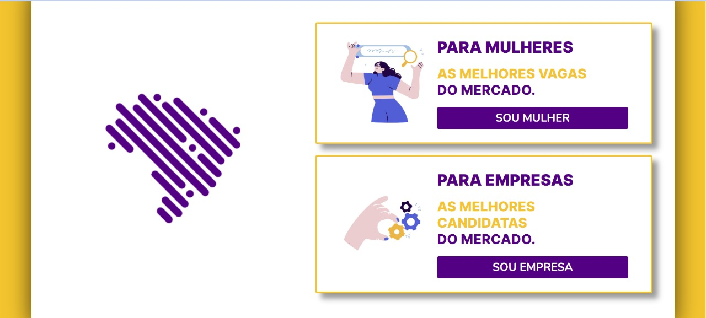

# Inteli - Instituto de Tecnologia e Liderança 

<p align="center">
<a href= "https://www.inteli.edu.br/"></a>
</p>

## Brazilians in Tech
<p align="center">
<a href= https://braziliansintech.com/></a>
</p>

## Lovelace

## Integrantes: 
- <a href="https://www.linkedin.com/in/amanda-fontes/">Amanda Ribeiro Fontes </a>
- <a href="https://www.linkedin.com/in/antonioribeiro893/">Antônio Ribeiro Cavalcante </a>
- <a href="https://www.linkedin.com/in/erikfreundt/">Erik Bonn Freundt </a> 
- <a href="https://www.linkedin.com/in/felipe-pereira-campos-250aa2231/">Felipe Pereira Campos </a> 
- <a href="https://www.linkedin.com/in/henriquemarlon/">Henrique Marlon Conceição Santos </a>
- <a href="https://www.linkedin.com/in/lyorreisquintao/">Lyorrei Shono Quintão </a>
- <a href="https://www.linkedin.com/in/sophia-dias/">Sophia Mello Dias </a> 


## Descrição
<br><br>
Nosso intuito é desenvolver uma ferramenta que viabilize diminuir o abismo entre mulheres que se interessem pela área de tecnologia e vagas na área STEM de forma fácil e simples, utilizando a estratégia de Employer Branding como principal diferencial.
<br><br>
<p align="center">

</p>


<br><br>
Tendo em vista o grande gap existente entre as mulheres e o mercado de trabalho e, por outro lado, um crescente aumento na necessidade de mão de obra tech, nosso sistema foi criado com o intúito de ser uma via de solução à essas duas problemáticas.
<br><br>
Com um algoritmo baseado nas hard e soft skills da candidata e da vaga, o match é realizado pela porcentagem de semelhança entre as duas (pelo menos 50%), mas só é finalizado a partir de quando a candidata realiza um like no perfil da empresa, este baseado na sua cultura e valores. Ou seja, o like é realizado a partir da identificação da usuária de seus valores com a cultura e valores da empresa que possui vagas compatíveis a suas competências.
<br><br>
Portanto, desenvolvemos uma ferramenta que possibilita o encontro mais fácil de candidatas compatíveis a vagas disponíveis tanto em competências de mercado (técnicas e interpessoais), quanto em alinhamento de valores pessoais ao da empresa, possibilitando uma maior inserção de mulheres no mercado de trabalho.
<br><br>
<br><br>

## 🛠 Estrutura de pastas

-Projeto4<br>
|<a href="https://github.com/2022M2T1/Projeto4/tree/main/.vscode">
📂.vscode</a><br>
  &emsp;settings.json<br>
|<a href="https://github.com/2022M2T1/Projeto4/tree/main/documentos">
>📂documentos</a><br>
  &emsp;|--><a href="https://github.com/2022M2T1/Projeto4/tree/main/documentos/antigos">📂antigos</a><br>
    📃WAD - Documento Aplicação Web (GRUPO 04).docx.pdf<br>
    📃WAD - Documento Aplicação Web (Grupo 04) - Versão 4.2<br>
    📃WAD - Grupo 04 - Versão 3.2.pdf<br>
    📃WAD - Versão 2.pdf<br>
  &emsp;|--><a href="https://github.com/2022M2T1/Projeto4/blob/main/documentos/WAD%20-%20Documento%20Aplica%C3%A7%C3%A3o%20Web%20(Grupo%2004)%20-%20Vers%C3%A3o%205.2.pdf>WAD - Documento Aplicação Web (Grupo 04) - Versão 5.2</a><br>
  &emsp;📃Documentação.docx<br>
|<a href=https://github.com/2022M2T1/Projeto4/tree/main/imagens><br>
📂Imagens</a><br>
  &emsp;|-->Bootstrap_5.0_Screenshot.png<br>
|<a href="https://github.com/2022M2T1/Projeto4/tree/main/src"><br>
📂src</a><br>
  &emsp;|--><a href="https://github.com/2022M2T1/Projeto4/tree/main/src/Backend">📂Backend</a><br>
         |<a href="https://github.com/2022M2T1/Projeto4/tree/main/src/Backend/database">📂database</a><br>
            🔘bit.db<br>
         |<a href="https://github.com/2022M2T1/Projeto4/tree/main/src/Backend/middlewares">📂middlewares</a><br>
            <a href="https://emoji.gg/emoji/8009-java-js"></a> auth.js<br>
         |<a href="https://github.com/2022M2T1/Projeto4/tree/main/src/Backend/routers">📂routers</a><br>
            <a href="https://emoji.gg/emoji/8009-java-js"></a> admin.js<br>
            <a href="https://emoji.gg/emoji/8009-java-js"></a> area.js<br>
            <a href="https://emoji.gg/emoji/8009-java-js"></a> company.js<br>
            <a href="https://emoji.gg/emoji/8009-java-js"></a> job.js<br>
            <a href="https://emoji.gg/emoji/8009-java-js"></a> skill.js<br>
            <a href="https://emoji.gg/emoji/8009-java-js"></a> user.js<br>
            <a href="https://emoji.gg/emoji/8009-java-js"></a> index.js<br>
            🔘package-lock.json<br>
            🔘package.json<br>
  &emsp;|--><a href="https://github.com/2022M2T1/Projeto4/tree/main/src/Frontend">📂Frontend</a><br>
          |<a href="https://github.com/2022M2T1/Projeto4/tree/main/src/Frontend/assets">📂assets</a><br>
            |<a href="https://github.com/2022M2T1/Projeto4/tree/main/src/Frontend/assets/companyRegistration">📂comapnyRegistration</a><br>
              📷likeIcon.png<br>
            |<a href="https://github.com/2022M2T1/Projeto4/tree/main/src/Frontend/assets/companyProfile">📂comapnyProfile</a><br>
              📷infoWhite.png<br>
              📷infoYellow.png<br>
              📷saveWhite.png<br>
              📷saveYellow.png<br>
              📷uploadWhite.png<br>
              📷uploadYellow.png<br>
            |<a href="https://github.com/2022M2T1/Projeto4/tree/main/src/Frontend/assets/companySignUpCompleted">📂comapnySingUpCompleted</a><br>
              📷logo.png<br>
            |<a href="https://github.com/2022M2T1/Projeto4/tree/main/src/Frontend/assets/icons">📂icons</a><br>
              📷back.png<br>
              📷edit.png<br>
              📷eye.png<br>
              📷person.png<br>
              📷person.png<br>
              📷trachIcon.png<br>
            |<a href="https://github.com/2022M2T1/Projeto4/tree/main/src/Frontend/assets/jqueryMask">📂jqueryMask</a><br>
              <a href="https://emoji.gg/emoji/8009-java-js"></a> jquery.mask.min.js
            |<a href="https://github.com/2022M2T1/Projeto4/tree/main/src/Frontend/assets/landingPage">📂landingPage</a><br>
              📷bitLogo.png<br>
              📷hand.gif<br>
              📷womanSearching.gif<br>
            |<a href="https://github.com/2022M2T1/Projeto4/tree/main/src/Frontend/assets/loginPage">📂loginPage</a><br>
              📷login.gif<br>
            |<a href="https://github.com/2022M2T1/Projeto4/tree/main/src/Frontend/assets/skills">📂skills</a><br>
              📷trashIcon/png<br>
          |<a href="https://github.com/2022M2T1/Projeto4/tree/main/src/Frontend/global">📂global</a><br>
            <a href="https://emoji.gg/emoji/8009-java-js"></a> global.js<br>
          |<a href="https://github.com/2022M2T1/Projeto4/tree/main/src/Frontend/styles">📂styles</a><br>
            <a href="https://emoji.gg/emoji/8517-css"></a> global.css<br>
          |<a href="https://github.com/2022M2T1/Projeto4/tree/main/src/Frontend/views">📂views</a><br>
          |<a href="https://github.com/2022M2T1/Projeto4/tree/main/src/Frontend/views/area">📂area</a><br>
              <a href="https://emoji.gg/emoji/8517-css"></a> area.css<br>
               <a href="https://emoji.gg/emoji/GoogleChrome"></a> area.html<br>
              <a href="https://emoji.gg/emoji/8009-java-js"></a> area.js<br>
            |<a href="https://github.com/2022M2T1/Projeto4/tree/main/src/Frontend/views/candidateProfile">📂candidateProfile</a><br>
              <a href="https://emoji.gg/emoji/8517-css"></a> candidateProfile.css<br>
               <a href="https://emoji.gg/emoji/GoogleChrome"></a> candidateProfile.html<br>
              <a href="https://emoji.gg/emoji/8009-java-js"></a> candidateProfile.js<br>
            |<a href="https://github.com/2022M2T1/Projeto4/tree/main/src/Frontend/views/candidates">📂candidates</a><br>
              <a href="https://emoji.gg/emoji/8517-css"></a> candidates.css<br>
              <a href="https://emoji.gg/emoji/GoogleChrome"></a> candidate.html<br>
              <a href="https://emoji.gg/emoji/8009-java-js"></a> candidate.js<br>
            |<a href="https://github.com/2022M2T1/Projeto4/tree/main/src/Frontend/views/companies">📂companies</a><br>
              <a href="https://emoji.gg/emoji/8517-css"></a> companies.css<br>
              <a href="https://emoji.gg/emoji/GoogleChrome"></a> companies.html<br>
              <a href="https://emoji.gg/emoji/8009-java-js"></a> companies.js<br>
            |<a href="https://github.com/2022M2T1/Projeto4/tree/main/src/Frontend/views/companyApproval">📂companyApproval</a><br>
              <a href="https://emoji.gg/emoji/8517-css"></a> companyApproval.css<br>
               <a href="https://emoji.gg/emoji/GoogleChrome"></a> companyApproval.html<br>
              <a href="https://emoji.gg/emoji/8009-java-js"></a> companyApproval.js<br>
            |<a href="https://github.com/2022M2T1/Projeto4/tree/main/src/Frontend/views/companyMatch">📂companyMatch</a><br>
              <a href="https://emoji.gg/emoji/8517-css"></a> companyMatch.css<br>
               <a href="https://emoji.gg/emoji/GoogleChrome"></a> companyMatch.html<br>
              <a href="https://emoji.gg/emoji/8009-java-js"></a> companyMatch.js<br>
            |<a href="https://github.com/2022M2T1/Projeto4/tree/main/src/Frontend/views/companyProfile">📂companyProfile</a><br>
              <a href="https://emoji.gg/emoji/8517-css"></a> companyProfile.css<br>
               <a href="https://emoji.gg/emoji/GoogleChrome"></a> companyProfile.html<br>
              <a href="https://emoji.gg/emoji/8009-java-js"></a> companyProfile.js<br>
            |<a href="https://github.com/2022M2T1/Projeto4/tree/main/src/Frontend/views/companyRegistration">📂companyRegistration</a><br>
              <a href="https://emoji.gg/emoji/8517-css"></a> companyRegistration.css<br>
               <a href="https://emoji.gg/emoji/GoogleChrome"></a> companyRegistration.html<br>
              <a href="https://emoji.gg/emoji/8009-java-js"></a> companyRehistration.js<br>
            |<a href="https://github.com/2022M2T1/Projeto4/tree/main/src/Frontend/views/companySignUpCompleted">📂companySignUpCompleted</a><br>
              <a href="https://emoji.gg/emoji/8517-css"></a> companySignUpCompleted.css<br>
               <a href="https://emoji.gg/emoji/GoogleChrome"></a> companySignUpCompleted.html<br>
              <a href="https://emoji.gg/emoji/8009-java-js"></a> companySignUpCompleted.js<br>
            |<a href="https://github.com/2022M2T1/Projeto4/tree/main/src/Frontend/views/createJob">📂createJob</a><br>
              <a href="https://emoji.gg/emoji/8517-css"></a> createJob.css<br>
               <a href="https://emoji.gg/emoji/GoogleChrome"></a> createJob.html<br>
              <a href="https://emoji.gg/emoji/8009-java-js"></a> createJob.js<br>
            |<a href="https://github.com/2022M2T1/Projeto4/tree/main/src/Frontend/views/jobs">📂jobs</a><br>
              <a href="https://emoji.gg/emoji/8517-css"></a> jobs.css<br>
               <a href="https://emoji.gg/emoji/GoogleChrome"></a> jobs.html<br>
              <a href="https://emoji.gg/emoji/8009-java-js"></a> jobs.js<br>
            |<a href="https://github.com/2022M2T1/Projeto4/tree/main/src/Frontend/views/landingPage">📂landingPage</a><br>
              <a href="https://emoji.gg/emoji/8517-css"></a> landingPage.css<br>
               <a href="https://emoji.gg/emoji/GoogleChrome"></a> landingPage.html<br>
              <a href="https://emoji.gg/emoji/8009-java-js"></a> landingPage.js<br>
            |<a href="https://github.com/2022M2T1/Projeto4/tree/main/src/Frontend/views/loginPage">📂loginPage</a><br>
              <a href="https://emoji.gg/emoji/8517-css"></a> loginPage.css<br>
               <a href="https://emoji.gg/emoji/GoogleChrome"></a> loginPage.html<br>
              <a href="https://emoji.gg/emoji/8009-java-js"></a> loginPage.js<br>
            |<a href="https://github.com/2022M2T1/Projeto4/tree/main/src/Frontend/views/skills">📂skills</a><br>
              <a href="https://emoji.gg/emoji/8517-css"></a> skills.css<br>
               <a href="https://emoji.gg/emoji/GoogleChrome"></a> skisls.html<br>
              <a href="https://emoji.gg/emoji/8009-java-js"></a> skills.js<br>
            |<a href="https://github.com/2022M2T1/Projeto4/tree/main/src/Frontend/views/userProfile">📂userProfile</a><br>
              <a href="https://emoji.gg/emoji/8517-css"></a> userProfile.css<br>
               <a href="https://emoji.gg/emoji/GoogleChrome"></a> userProfile.html<br>
              <a href="https://emoji.gg/emoji/8009-java-js"></a> userProfile.js<br>
            |<a href="https://github.com/2022M2T1/Projeto4/tree/main/src/Frontend/views/userProfileEdit/descarte">📂userProfileEdit/descarte</a><br>
              <a href="https://emoji.gg/emoji/8517-css"></a> userProfileEdit.css<br>
               <a href="https://emoji.gg/emoji/GoogleChrome"></a> userProfileEdit.html<br>
              <a href="https://emoji.gg/emoji/8009-java-js"></a> userProfileEdit.js<br>
            |<a href="https://github.com/2022M2T1/Projeto4/tree/main/src/Frontend/views/userSignUp">📂userSignUp</a><br>
              <a href="https://emoji.gg/emoji/8517-css"></a> userSignUp.css<br>
               <a href="https://emoji.gg/emoji/GoogleChrome"></a> userSignUp.html<br>
              <a href="https://emoji.gg/emoji/8009-java-js"></a> userSignUp.js<br>
            |<a href="https://github.com/2022M2T1/Projeto4/tree/main/src/Frontend/views/viewCompany">📂viewCompany</a><br>
              <a href="https://emoji.gg/emoji/8517-css"></a> viewCompany.css<br>
               <a href="https://emoji.gg/emoji/GoogleChrome"></a> viewCompany.html<br>
              <a href="https://emoji.gg/emoji/8009-java-js"></a> viewCompany.js<br>
⚙️.gitattributes<br>
⚙️.gitignore<br>
|Procfile<br>
🌐README.md<br>

## 💻 Configuração para desenvolvimento

Aqui encontram-se todas as instruções necessárias para a instalação de todos os programas, bibliotecas e ferramentas imprescindíveis para a configuração do ambiente de desenvolvimento.

1.  Baixar e instalar o node.js:  [https://nodejs.org/pt-br/](https://nodejs.org/pt-br/) (versão 16.15.1 LTS)
2. Clone o repositório em questão.
3.  No modo administrador, abra o "prompt de comando" ou o "terminal" e, após,  abra a pasta "src/backend" no diretório raiz do repositório clonado e digite o segundo comando:

```sh
npm install
npm install sqlite3
npm install express --save
npm install -g nodemon
```

Isso instalará todas as dependências definidas no arquivo <b>package.json</b> que são necessárias para rodar o projeto. Agora o projeto já está pronto para ser modificado. Caso ainda deseje iniciar a aplicação, digite o comando abaixo no terminal:

```sh
cd src
cd BackEnd
npm rum start ou node index.js
```
5. Agora você pode acessar a aplicação através do link http://localhost:3000/
6. O servidor está online.


## 🗃 Histórico de lançamentos

A cada atualização os detalhes devem ser lançados aqui.

* 0.2.1 - 13/06/2022
    *Refinamento do site
* 0.2.1 - 30/05/2022
    *Término da criação das rotas
    *Início da incrementação da integração das páginas
* 0.2.0 - 16/05/2022
    * Modelagem e implementação do banco de dados
    *Início à criação das rotas
* 0.1.1 - 02/05/2022
    * Implementação do Javascript nas páginas
* 0.1.0 - 25/04/2022
    * Criação das páginas e estilização
* 0.0.1 - 20/04/2022
    * Trabalho iniciado

## 📋 Licença/License
<p xmlns:cc="http://creativecommons.org/ns#" xmlns:dct="http://purl.org/dc/terms/"><a property="dct:title" rel="cc:attributionURL" href="https://github.com/2022M2T1/Projeto4">MODELO GIT INTELI</a> by <a rel="cc:attributionURL dct:creator" property="cc:attributionName" href="https://linklist.bio/LoveLace_Grupo4_-_Inteli">Inteli, Amanda Ribeiro Fontes, Antônio Ribeiro Cavalcante, Erik Bonn Freundt, Felipe Pereira Campos, Henrique Marlon Conceição Santos, Lyorrei Shono Quintão, Sophia Mello Dias</a> is licensed under <a href="http://creativecommons.org/licenses/by/4.0/?ref=chooser-v1" target="_blank" rel="license noopener noreferrer" style="display:inline-block;">Attribution 4.0 International</a>.</p>
## 🎓 Referências

Aqui estão as referências usadas no projeto.

1. <https://nodejs.org/en/download/>
2. <https://www.sqlite.org/download.html>
3. <https://www.postman.com/downloads/>
4. <https://sqlitebrowser.org/dl/>
5. <https://www.flaticon.com/uicons/3>
6. <https://fontawesome.com/>
7. <https://coolors.co/f3c42e-530084-280044-ffffff-4563cd>

